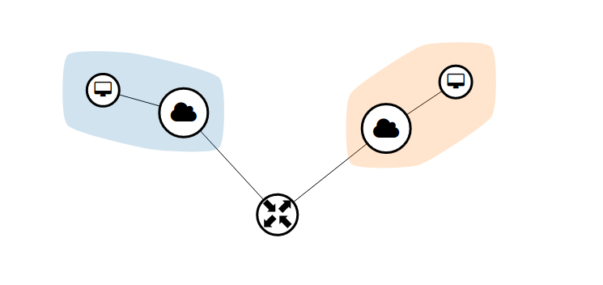

# Preface

Note : **This is only a Proof of Concept Project to help you with openstack development, Not for production use**

Today, we will  start working on the development of Openstack.

In practice, people have different thoughts on developing on OpenStack.
 - Plugin Development to extend the functionality of the platform (Core Team Only)
 - Dashboard Extension Customization Development to improve the visualization effect of OpenStack 
 - **Interaction with Openstack using API or client command.**
    - Openstack SDK
        - Apache jclouds
        - Openstack-java-sdk
        - openstack4j
        - openstacksdk
    - **API Based Customization Developement**
- **Supporting tools, systems or scripts that cater to user needs**

Below is a Proof of Concept Script-based project

# Reference
When we start working on api-based developement, there are is a must supporting-documents that we should refer to:

<a href="docs.openstack.org/api-quick-start">api-quick-start</a>

# Guide : How to get Identity Token

Generate payload as the params.
```
    payload = {
        "auth": {
            "identity": {
                "methods": [
                    "password"
                ],
                "password": {
                    "user": {
                        "name": username,
                        "domain": {
                            "name": user_domain_name
                        },
                        "password": password
                    }
                }
            },
            "scope": {
                "system" : {
                    "all": True
                }
            }
        }
    }
```
Use request library to perform the query
```
    response = requests.post(auth_url, data=json.dumps(payload))
```
Then additional operation could be performed on the given response.

# Practice : Finish tasks
 - Task1 : Print out list of Networks
 - Task2 : Create one's own instance
 - Task3 : Create an scenario with 2 networks connected by a router. The topology should like below.

 

Check the solution in the **Solutions** Folder.

# Conclusion:
 - Using API-Based Request is a quick way to organize the flow of activity
 - However, some addition work should be done if we want advance performance of the system as script-based is not convenient.

 **Note** : In real practice, script-based serive is not recommended, We recommend using SPRINGBOOT, FLASK which provides API/RPC to higher level services for better improved performance.