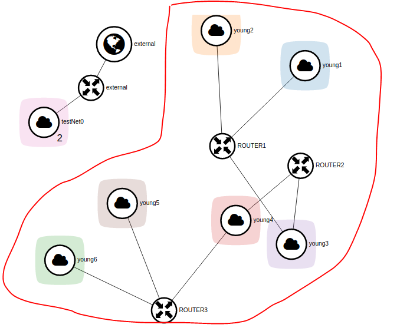

# Preface

Note : **This is only a Proof of Concept Project by Young, Not for production uses**

On the first day, we have tried to build a scenario in TASK 3. In the scenario, 2 Networks, 2 Subnets, 2 Ports and 1 Router. But what is the relationship between them?

# Basis

Before start working on modelling of openstack network components, We have to understand some basics.

Network : an isolated layer-2 broadcast domain

- The subnets in the network is automatically connected

Subnet : IPv4/IPv6 cidr

- 1 subnet can only belong to 1 network
- subnets in the same network cannot overlap in cidr (if networks are connected through one router, this will also cause problems)
- Manages the instances and connectivity via ports

Port : A port in the virtual Switch, with MAC and IP address defined

- The connectivity is made though the communication between ports
- Port will be binded to the instance's VIF(Virtual Interface) and MAC and IP address would be allocated to the VIF.
- 1 port only belongs to 1 subnet
- In modeling, we only discuss the port connected to the router for better connectivity configuration

Router : A virtual router which supports routing functionality.
- Ports are attached to the Router(You need to learn the process)

# Modeling

Often, our OpenStack-based service is not only script-based, the components in OpenStack should be modeled for bettet programming.

Note : For simplicity, we only talk about the ports that are attached to router interfaces

**Task 1: Model Components**

Complete the **modeling.py** to abstract the basic functions of network components

```python

class Network:
    pass

class SubNetwork:
    pass

class Port:
    pass

class Router:
    pass

class Server:
    pass
```

**Task 2: Reproduce simple scenario**

Try to reproduce the simple scenario as we did yesterday (1 router, 2 network, and 2 instances)

**Task 3: Create complex scenario**

Complete the following code part to generate complex scenario according to the following diagram
For simplicity, there is only 1 subnet in 1 network



```python
def task_createComplexScenario():
    pass
```

Any problem found?
Static Routing is required? But how can we manage to perform auto-configuration?

**Task 4: Auto-Configuration ALGO**

Try to find an algo to perform auto-configuration of the networks, to ensure that all instances are connected automatically via the help of ALGO.
Free free to add some sub functions, or change input params

```python
# Try to perform static routing algo, change anything that is needed
# Delete the previous scenario before starting a new one!!!
def task_algo():
	pass
```